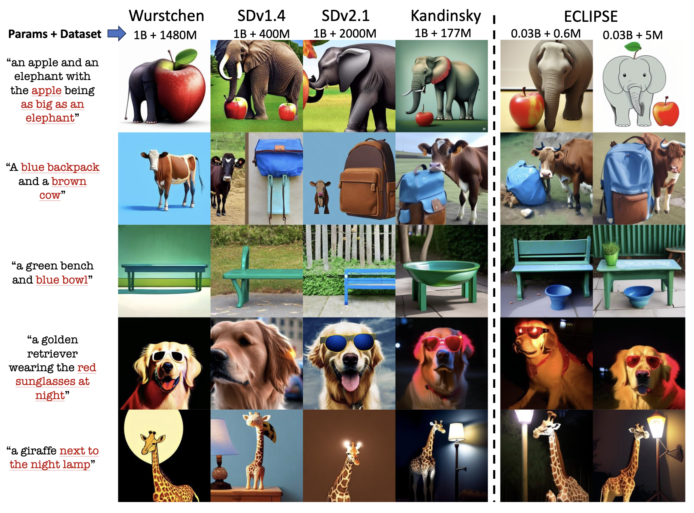
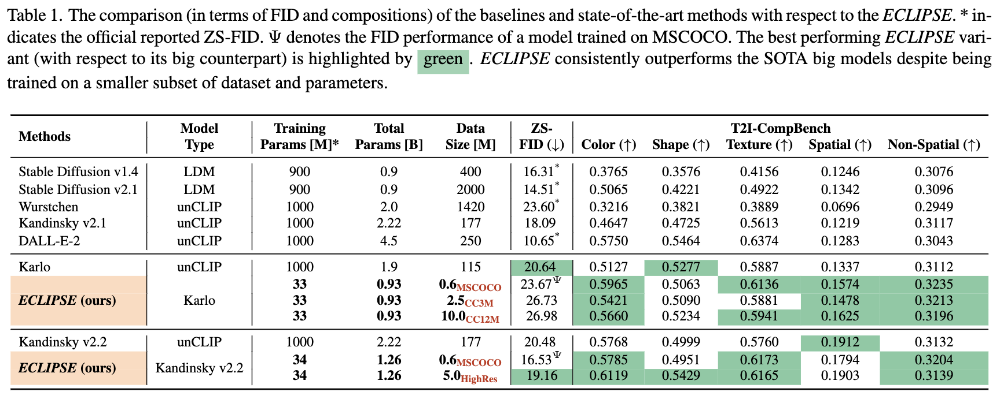

## <div align="center"> <i>ECLIPSE</i>: Revisiting the Text-to-Image Prior for Effecient Image Generation </div>

<div align="center">
  <a href="https://eclipse-t2i.vercel.app/"></a> &ensp;
  <a href="https://arxiv.org/abs/2312.04655/"></a> &ensp;
  <a href="https://huggingface.co/spaces/ECLIPSE-Community/ECLIPSE-Kandinsky-v2.2"></a> &ensp;

</div>

---

This repository contains the inference code for our paper, ECLIPSE.
We show how to utilize the pre-trained ECLIPSE text-to-image prior associated with diffusion image decoders such as Karlo and Kandinsky.

- ECLIPSE presents the tiny prior learning strategy that compresses the previous prior models from 1 billion parameters down to 33 million parameters.
- Additionally, ECLIPSE prior is trained on a mere 5 million image-text (alt-text) pairs.

> **_News:_**  Checkout our latest work, [&lambda;-ECLIPSE](https://eclipse-t2i.github.io/Lambda-ECLIPSE/) extending the T2I priors for effecient zero-shot multi-subject driven text-to-image generations. 


**Please follow the below steps to run the inference locally.**

---

**Qualitative Comparisons:**



**Quantitative Comparisons:**


## TODOs:

- [x] ~~Release ECLIPSE priors for Kandinsky v2.2 and Karlo-v1-alpha.~~
- [x] ~~Release the demo.~~
- [ ] Release ECLIPSE prior with Kandinsky v2.2 LCM decoder. (soon!)
- [ ] Release ECLIPSE prior training code. (will be released in seperate repository)


## Setup

### Installation
```bash
git clone git@github.com:eclipse-t2i/eclipse-inference.git

conda create -p ./venv python=3.9
pip install -r requirements.txt
```

### Demo
```bash
conda activate ./venv
gradio main.py
```

## Run Inference

This repository supports two pre-trained image decoders: [Karlo-v1-alpha](https://huggingface.co/kakaobrain/karlo-v1-alpha) and [Kandinsky-v2.2](https://huggingface.co/kandinsky-community/kandinsky-2-2-decoder).

**Note:** ECLIPSE prior is not a diffusion model -- while image decoders are.


### Kandinsky Inference
```python
from transformers import CLIPTextModelWithProjection, CLIPTokenizer
from src.pipelines.pipeline_kandinsky_prior import KandinskyPriorPipeline
from src.priors.prior_transformer import PriorTransformer
from diffusers import DiffusionPipeline

text_encoder = (
    CLIPTextModelWithProjection.from_pretrained(
        "laion/CLIP-ViT-bigG-14-laion2B-39B-b160k",
        projection_dim=1280,
        torch_dtype=torch.float32,
    )
) 

tokenizer = CLIPTokenizer.from_pretrained(
    "laion/CLIP-ViT-bigG-14-laion2B-39B-b160k"
)

prior = PriorTransformer.from_pretrained("ECLIPSE-Community/ECLIPSE_KandinskyV22_Prior")
pipe_prior = KandinskyPriorPipeline.from_pretrained("kandinsky-community/kandinsky-2-2-prior",    
  prior=prior,
  text_encoder=text_encoder,
  tokenizer=tokenizer,
).to("cuda")

pipe = DiffusionPipeline.from_pretrained("kandinsky-community/kandinsky-2-2-decoder").to("cuda")

prompt = "black apples in the basket"
image_embeds, negative_image_embeds = pipe_prior(prompt).to_tuple()
images = pipe(
    num_inference_steps=50,
    image_embeds=image_embeds,
    negative_image_embeds=negative_image_embeds,
).images

images[0]
```


### Karlo Inference
```python
from src.pipelines.pipeline_unclip import UnCLIPPipeline
from src.priors.prior_transformer import PriorTransformer

prior = PriorTransformer.from_pretrained("ECLIPSE-Community/ECLIPSE_Karlo_Prior")
pipe = UnCLIPPipeline.from_pretrained("kakaobrain/karlo-v1-alpha", prior=prior).to("cuda")

prompt="black apples in the basket"
images = pipe(prompt, decoder_guidance_scale=7.5).images

images[0]
```

# Acknowledgement

We would like to acknoweldge excellent open-source text-to-image models (Kalro and Kandinsky) without them this work would not have been possible. Also, we thank HuggingFace for streamlining the T2I models.
